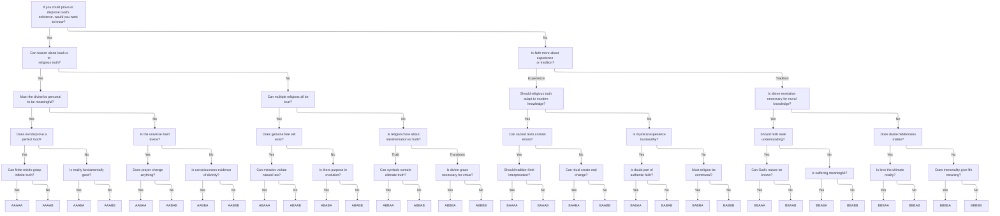
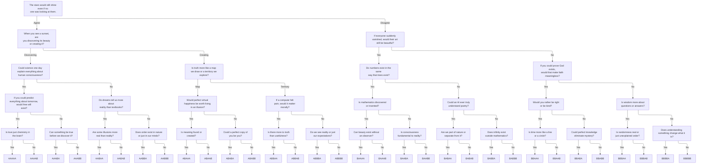
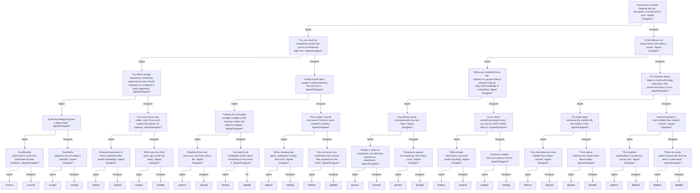
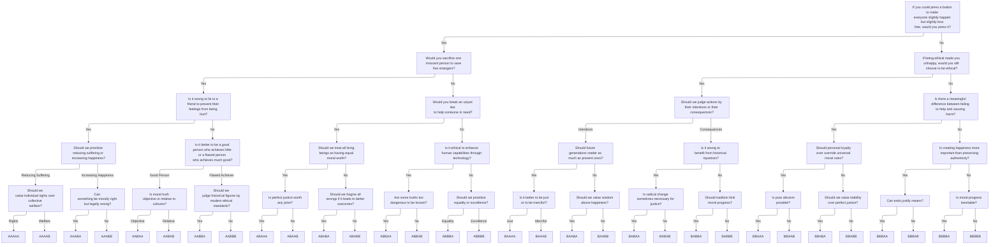
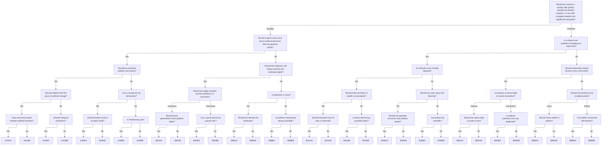
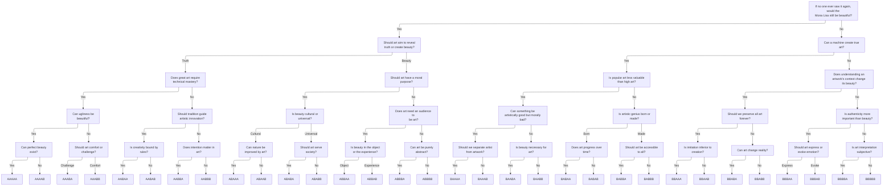

<!-- cmd shift v -->

Theology

```mermaid
%%{init: {'theme': 'default', "flowchart" : { "curve" : "basis", "defaultRenderer": "elk"} } }%%
%% add panzoom
%%{init: { 'sequence': { 'showSequenceNumbers': true } } }%%

graph TD
    Q1["If you could prove or disprove God's 
existence, would you want to know?"]
    
    Q1 -->|Yes| A["Can reason alone lead us to 
religious truth?"]
    Q1 -->|No| B["Is faith more about experience 
or tradition?"]
    
    A -->|Yes| AA["Must the divine be personal 
to be meaningful?"]
    A -->|No| AB["Can multiple religions all be 
true?"]
    
    B -->|Experience| BA["Should religious truth 
adapt to modern knowledge?"]
    B -->|Tradition| BB["Is divine revelation 
necessary for moral knowledge?"]
    
    AA -->|Yes| AAA["Does evil disprove a 
perfect God?"]
    AA -->|No| AAB["Is the universe itself 
divine?"]
    
    AB -->|Yes| ABA["Does genuine free will 
exist?"]
    AB -->|No| ABB["Is religion more about 
transformation or truth?"]
    
    BA -->|Yes| BAA["Can sacred texts contain 
errors?"]
    BA -->|No| BAB["Is mystical experience 
trustworthy?"]
    
    BB -->|Yes| BBA["Should faith seek 
understanding?"]
    BB -->|No| BBB["Does divine hiddenness 
matter?"]
    AAA -->|Yes| AAAA["Can finite minds grasp 
infinite truth?"]
    AAA -->|No| AAAB["Is reality fundamentally 
good?"]
    
    AAB -->|Yes| AABA["Does prayer change 
anything?"]
    AAB -->|No| AABB["Is consciousness evidence 
of divinity?"]
    
    ABA -->|Yes| ABAA["Can miracles violate 
natural law?"]
    ABA -->|No| ABAB["Is there purpose in 
evolution?"]
    
    ABB -->|Truth| ABBA["Can symbols contain 
ultimate truth?"]
    ABB -->|Transform| ABBB["Is divine grace 
necessary for virtue?"]
    
    BAA -->|Yes| BAAA["Should tradition limit 
interpretation?"]
    BAA -->|No| BAAB["Can ritual create real 
change?"]
    
    BAB -->|Yes| BABA["Is doubt part of 
authentic faith?"]
    BAB -->|No| BABB["Must religion be 
communal?"]
    
    BBA -->|Yes| BBAA["Can God's nature be 
known?"]
    BBA -->|No| BBAB["Is suffering meaningful?"]
    
    BBB -->|Yes| BBBA["Is love the ultimate 
reality?"]
    BBB -->|No| BBBB["Does immortality give life 
meaning?"]
    
    AAAA -->|Yes| AAAAA
    AAAA -->|No| AAAAB
    AAAB -->|Yes| AAABA
    AAAB -->|No| AAABB
    AABA -->|Yes| AABAA
    AABA -->|No| AABAB
    AABB -->|Yes| AABBA
    AABB -->|No| AABBB
    ABAA -->|Yes| ABAAA
    ABAA -->|No| ABAAB
    ABAB -->|Yes| ABABA
    ABAB -->|No| ABABB
    ABBA -->|Yes| ABBAA
    ABBA -->|No| ABBAB
    ABBB -->|Yes| ABBBA
    ABBB -->|No| ABBBB
    BAAA -->|Yes| BAAAA
    BAAA -->|No| BAAAB
    BAAB -->|Yes| BAABA
    BAAB -->|No| BAABB
    BABA -->|Yes| BABAA
    BABA -->|No| BABAB
    BABB -->|Yes| BABBA
    BABB -->|No| BABBB
    BBAA -->|Yes| BBAAA
    BBAA -->|No| BBAAB
    BBAB -->|Yes| BBABA
    BBAB -->|No| BBABB
    BBBA -->|Yes| BBBAA
    BBBA -->|No| BBBAB
    BBBB -->|Yes| BBBBA
    BBBB -->|No| BBBBB
```

Ontology

```mermaid
%%{init: {'theme': 'default', "flowchart" : { "curve" : "basis", "defaultRenderer": "elk"} } }%%
%% add panzoom
%%{init: { 'sequence': { 'showSequenceNumbers': true } } }%%

graph TD
    Q1["The stars would still shine even if no 
one was looking at them."]
    
    Q1 -->|Agree| A["When you see a sunset, are 
you discovering its beauty or creating it?"]
    Q1 -->|Disagree| B["If everyone suddenly 
vanished, would their art still be beautiful?"]
    
    A -->|Discovering| AA["Could science one day 
explain everything about human consciousness?"]
    A -->|Creating| AB["Is truth more like a map 
we draw or a territory we explore?"]
    
    B -->|Yes| BA["Do numbers exist in the same 
way that trees exist?"]
    B -->|No| BB["If you could prove God exists, 
would that make faith meaningless?"]
    
    AA -->|Yes| AAA["If you could predict 
everything about tomorrow, would free will 
exist?"]
    AA -->|No| AAB["Do dreams tell us more about 
reality than textbooks?"]
    
    AB -->|Map| ABA["Would perfect virtual 
happiness be worth living in an illusion?"]
    AB -->|Territory| ABB["If a computer felt 
pain, would it matter morally?"]
    
    BA -->|Yes| BAA["Is mathematics discovered 
or invented?"]
    BA -->|No| BAB["Could an AI ever truly 
understand poetry?"]
    
    BB -->|Yes| BBA["Would you rather be right 
or be kind?"]
    BB -->|No| BBB["Is wisdom more about 
questions or answers?"]
    AAA -->|Yes| AAAA["Is love just chemistry in 
the brain?"]
    AAA -->|No| AAAB["Can something be true 
before we discover it?"]
    
    AAB -->|Yes| AABA["Are some illusions more 
real than reality?"]
    AAB -->|No| AABB["Does order exist in nature 
or just in our minds?"]
    
    ABA -->|Yes| ABAA["Is meaning found or 
created?"]
    ABA -->|No| ABAB["Could a perfect copy of 
you be you?"]
    
    ABB -->|Yes| ABBA["Is there more to truth 
than usefulness?"]
    ABB -->|No| ABBB["Do we see reality or just 
our expectations?"]
    
    BAA -->|Yes| BAAA["Can beauty exist without 
an observer?"]
    BAA -->|No| BAAB["Is consciousness 
fundamental to reality?"]
    
    BAB -->|Yes| BABA["Are we part of nature or 
separate from it?"]
    BAB -->|No| BABB["Does infinity exist 
outside mathematics?"]
    
    BBA -->|Yes| BBAA["Is time more like a line 
or a circle?"]
    BBA -->|No| BBAB["Could perfect knowledge 
eliminate mystery?"]
    
    BBB -->|Yes| BBBA["Is randomness real or 
just unexplained order?"]
    BBB -->|No| BBBB["Does understanding 
something change what it is?"]
    
    AAAA -->|Yes| AAAAA
    AAAA -->|No| AAAAB
    AAAB -->|Yes| AAABA
    AAAB -->|No| AAABB
    AABA -->|Yes| AABAA
    AABA -->|No| AABAB
    AABB -->|Yes| AABBA
    AABB -->|No| AABBB
    ABAA -->|Yes| ABAAA
    ABAA -->|No| ABAAB
    ABAB -->|Yes| ABABA
    ABAB -->|No| ABABB
    ABBA -->|Yes| ABBAA
    ABBA -->|No| ABBAB
    ABBB -->|Yes| ABBBA
    ABBB -->|No| ABBBB
    BAAA -->|Yes| BAAAA
    BAAA -->|No| BAAAB
    BAAB -->|Yes| BAABA
    BAAB -->|No| BAABB
    BABA -->|Yes| BABAA
    BABA -->|No| BABAB
    BABB -->|Yes| BABBA
    BABB -->|No| BABBB
    BBAA -->|Yes| BBAAA
    BBAA -->|No| BBAAB
    BBAB -->|Yes| BBABA
    BBAB -->|No| BBABB
    BBBA -->|Yes| BBBAA
    BBBA -->|No| BBBAB
    BBBB -->|Yes| BBBBA
    BBBB -->|No| BBBBB
```

Epistemology

```mermaid
%%{init: {'theme': 'default', "flowchart" : { "curve" : "basis", "defaultRenderer": "elk"} } }%%
%% add panzoom
%%{init: { 'sequence': { 'showSequenceNumbers': true } } }%%

graph TD
    Q1["'If everyone on Earth believed the sky 
was green, it would still be blue.' Agree/
Disagree?"]
    
    Q1 -->|Agree| A["'You can never be 
completely certain that you're not dreaming 
right now.' Agree/Disagree?"]
    Q1 -->|Disagree| B["'A tree falling in an 
empty forest still makes a sound.' Agree/
Disagree?"]
    
    A -->|Agree| AA["'If a million people 
experience something supernatural, their shared 
experience is evidence it really happened.' 
Agree/Disagree?"]
    A -->|Disagree| AB["'A baby knows what 
hunger is before learning the word for it.' 
Agree/Disagree?"]
    
    B -->|Agree| BA["'When you suddenly know the 
solution to a puzzle without solving it step by 
step, that knowledge is trustworthy.' Agree/
Disagree?"]
    B -->|Disagree| BB["'If a scientific theory 
helps us build technology that works, that 
proves the theory is true.' Agree/Disagree?"]
    
    AA -->|Agree| AAA["'Some knowledge requires 
a leap of faith.' Agree/Disagree?"]
    AA -->|Disagree| AAB["'You know how to ride 
a bike, even if you can't explain the physics of 
balance.' Agree/Disagree?"]
    
    AB -->|Agree| ABA["'Looking at a red apple 
in bright sunlight or dim evening creates two 
different realities.' Agree/Disagree?"]
    AB -->|Disagree| ABB["'The number 3 would 
exist even if humans never invented counting.' 
Agree/Disagree?"]
    
    BA -->|Agree| BAA["'Something can be 
simultaneously true and false.' Agree/
Disagree?"]
    BA -->|Disagree| BAB["'If you check 
something enough times, you can be 100% certain 
about it.' Agree/Disagree?"]
    
    BB -->|Agree| BBA["'If a belief helps 
someone live a better life, that makes it true.' 
Agree/Disagree?"]
    BB -->|Disagree| BBB["'Ancient wisdom is 
more reliable than modern science.' Agree/
Disagree?"]
    AAA -->|Agree| AAAA["'A sufficiently 
advanced AI could truly understand human 
emotions.' Agree/Disagree?"]
    AAA -->|Disagree| AAAB["'A perfectly 
objective view of reality is possible.' Agree/
Disagree?"]
    
    AAB -->|Agree| AABA["'Personal experience is 
more trustworthy than expert knowledge.' Agree/
Disagree?"]
    AAB -->|Disagree| AABB["'What was true 1000 
years ago is still true today.' Agree/
Disagree?"]
    
    ABA -->|Agree| ABAA["'Reading fiction can 
teach you real truths about life.' Agree/
Disagree?"]
    ABA -->|Disagree| ABAB["'You need to be 
completely certain about something to truly know 
it.' Agree/Disagree?"]
    
    ABB -->|Agree| ABBA["'When meeting new 
ideas, skepticism is better than trust.' Agree/
Disagree?"]
    ABB -->|Disagree| ABBB["'We can never truly 
understand how anyone else experiences the 
world.' Agree/Disagree?"]
    
    BAA -->|Agree| BAAA["'Reality is what we 
experience, not what lies beyond our 
experience.' Agree/Disagree?"]
    BAA -->|Disagree| BAAB["'If everyone agrees 
on something, that makes it true.' Agree/
Disagree?"]
    
    BAB -->|Agree| BABA["'With enough 
information, we could predict anything.' Agree/
Disagree?"]
    BAB -->|Disagree| BABB["'Everyone creates 
their own version of truth.' Agree/Disagree?"]
    
    BBA -->|Agree| BBAA["'Your memories are more 
reliable than written records.' Agree/
Disagree?"]
    BBA -->|Disagree| BBAB["'Pure logical 
thinking can reveal truths about reality.' 
Agree/Disagree?"]
    
    BBB -->|Agree| BBBA["'The simplest 
explanation is usually the correct one.' Agree/
Disagree?"]
    BBB -->|Disagree| BBBB["'There are some 
truths humans will never be able to understand.' 
Agree/Disagree?"]
    
    AAAA -->|Agree| AAAAA
    AAAA -->|Disagree| AAAAB
    AAAB -->|Agree| AAABA
    AAAB -->|Disagree| AAABB
    AABA -->|Agree| AABAA
    AABA -->|Disagree| AABAB
    AABB -->|Agree| AABBA
    AABB -->|Disagree| AABBB
    ABAA -->|Agree| ABAAA
    ABAA -->|Disagree| ABAAB
    ABAB -->|Agree| ABABA
    ABAB -->|No| ABABB
    ABBA -->|Agree| ABBAA
    ABBA -->|Disagree| ABBAB
    ABBB -->|Agree| ABBBA
    ABBB -->|Disagree| ABBBB
    BAAA -->|Agree| BAAAA
    BAAA -->|Disagree| BAAAB
    BAAB -->|Agree| BAABA
    BAAB -->|Disagree| BAABB
    BABA -->|Agree| BABAA
    BABA -->|Disagree| BABAB
    BABB -->|Agree| BABBA
    BABB -->|Disagree| BABBB
    BBAA -->|Agree| BBAAA
    BBAA -->|Disagree| BBAAB
    BBAB -->|Agree| BBABA
    BBAB -->|Disagree| BBABB
    BBBA -->|Agree| BBBAA
    BBBA -->|Disagree| BBBAB
    BBBB -->|Agree| BBBBA
    BBBB -->|Disagree| BBBBB
```

Ethics

```mermaid
%%{init: {'theme': 'default', "flowchart" : { "curve" : "basis", "defaultRenderer": "elk"} } }%%
%% add panzoom
%%{init: { 'sequence': { 'showSequenceNumbers': true } } }%%

graph TD
    Q1["If you could press a button to make 
everyone slightly happier but slightly less 
free, would you press it?"]
    
    Q1 -->|Yes| A["Would you sacrifice one 
innocent person to save five strangers?"]
    Q1 -->|No| B["If being ethical made you 
unhappy, would you still choose to be ethical?"]
    
    A -->|Yes| AA["Is it wrong to lie to a 
friend to prevent their feelings from being 
hurt?"]
    A -->|No| AB["Would you break an unjust law 
to help someone in need?"]
    
    B -->|Yes| BA["Should we judge actions by 
their intentions or their consequences?"]
    B -->|No| BB["Is there a meaningful 
difference between failing to help and causing 
harm?"]
    
    AA -->|Yes| AAA["Should we prioritize 
reducing suffering or increasing happiness?"]
    AA -->|No| AAB["Is it better to be a good 
person who achieves little or a flawed person 
who achieves much good?"]
    
    AB -->|Yes| ABA["Should we treat all living 
beings as having equal moral worth?"]
    AB -->|No| ABB["Is it ethical to enhance 
human capabilities through technology?"]
    
    BA -->|Intentions| BAA["Should future 
generations matter as much as present ones?"]
    BA -->|Consequences| BAB["Is it wrong to 
benefit from historical injustices?"]
    
    BB -->|Yes| BBA["Should personal loyalty 
ever override universal moral rules?"]
    BB -->|No| BBB["Is creating happiness more 
important than preserving authenticity?"]
    AAA -->|Reducing Suffering| AAAA["Should we 
value individual rights over collective 
welfare?"]
    AAA -->|Increasing Happiness| AAAB["Can 
something be morally right but legally wrong?"]
    
    AAB -->|Good Person| AABA["Is moral truth 
objective or relative to cultures?"]
    AAB -->|Flawed Achiever| AABB["Should we 
judge historical figures by modern ethical 
standards?"]
    
    ABA -->|Yes| ABAA["Is perfect justice worth 
any price?"]
    ABA -->|No| ABAB["Should we forgive all 
wrongs if it leads to better outcomes?"]
    
    ABB -->|Yes| ABBA["Are some truths too 
dangerous to be known?"]
    ABB -->|No| ABBB["Should we prioritize 
equality or excellence?"]
    
    BAA -->|Yes| BAAA["Is it better to be just 
or to be merciful?"]
    BAA -->|No| BAAB["Should we value wisdom 
above happiness?"]
    
    BAB -->|Yes| BABA["Is radical change 
sometimes necessary for justice?"]
    BAB -->|No| BABB["Should tradition limit 
moral progress?"]
    
    BBA -->|Yes| BBAA["Is pure altruism 
possible?"]
    BBA -->|No| BBAB["Should we value stability 
over perfect justice?"]
    
    BBB -->|Yes| BBBA["Can ends justify means?"]
    BBB -->|No| BBBB["Is moral progress 
inevitable?"]
    
    AAAA -->|Rights| AAAAA
    AAAA -->|Welfare| AAAAB
    AAAB -->|Yes| AAABA
    AAAB -->|No| AAABB
    AABA -->|Objective| AABAA
    AABA -->|Relative| AABAB
    AABB -->|Yes| AABBA
    AABB -->|No| AABBB
    ABAA -->|Yes| ABAAA
    ABAA -->|No| ABAAB
    ABAB -->|Yes| ABABA
    ABAB -->|No| ABABB
    ABBA -->|Yes| ABBAA
    ABBA -->|No| ABBAB
    ABBB -->|Equality| ABBBA
    ABBB -->|Excellence| ABBBB
    BAAA -->|Just| BAAAA
    BAAA -->|Merciful| BAAAB
    BAAB -->|Yes| BAABA
    BAAB -->|No| BAABB
    BABA -->|Yes| BABAA
    BABA -->|No| BABAB
    BABB -->|Yes| BABBA
    BABB -->|No| BABBB
    BBAA -->|Yes| BBAAA
    BBAA -->|No| BBAAB
    BBAB -->|Yes| BBABA
    BBAB -->|No| BBABB
    BBBA -->|Yes| BBBAA
    BBBA -->|No| BBBAB
    BBBB -->|Yes| BBBBA
    BBBB -->|No| BBBBB
```

Politics

```mermaid
%%{init: {'theme': 'default', "flowchart" : { "curve" : "basis", "defaultRenderer": "elk"} } }%%
%% add panzoom
%%{init: { 'sequence': { 'showSequenceNumbers': true } } }%%

graph TD
    Q1["Would you choose a society with perfect 
equality but limited freedom, or one with 
complete freedom but significant inequality?"]
    
    Q1 -->|Equality| A["Should experts have more 
say in political decisions than the general 
public?"]
    Q1 -->|Freedom| B["Is a citizen ever 
justified in breaking an unjust law?"]
    
    A -->|Yes| AA["Should we prioritize 
stability over justice?"]
    A -->|No| AB["Should the majority's will 
always prevail over individual rights?"]
    
    B -->|Yes| BA["Is revolution ever morally 
required?"]
    B -->|No| BB["Should citizenship require 
service to the community?"]
    
    AA -->|Yes| AAA["Should tradition limit the 
pace of political change?"]
    AA -->|No| AAB["Can a society be too 
democratic?"]
    
    AB -->|Yes| ABA["Should we judge societies 
by their intentions or outcomes?"]
    AB -->|No| ABB["Is patriotism a virtue?"]
    
    BA -->|Yes| BAA["Should there be limits on 
wealth accumulation?"]
    BA -->|No| BAB["Should we value unity over 
diversity?"]
    
    BB -->|Yes| BBA["Is property a natural right 
or social convention?"]
    BB -->|No| BBB["Should we prioritize local 
or global justice?"]
    AAA -->|Yes| AAAA["Does economic power 
threaten political freedom?"]
    AAA -->|No| AAAB["Should voting be 
mandatory?"]
    
    AAB -->|Yes| AABA["Should borders exist in 
an ideal world?"]
    AAB -->|No| AABB["Is meritocracy just?"]
    
    ABA -->|Intentions| ABAA["Should future 
generations have political rights?"]
    ABA -->|Outcomes| ABAB["Can a good person be 
a good ruler?"]
    
    ABB -->|Yes| ABBA["Should we tolerate the 
intolerant?"]
    ABB -->|No| ABBB["Is political compromise 
always possible?"]
    
    BAA -->|Yes| BAAA["Should education aim for 
unity or diversity?"]
    BAA -->|No| BAAB["Is direct democracy 
possible today?"]
    
    BAB -->|Yes| BABA["Should we separate 
economic and political power?"]
    BAB -->|No| BABB["Can politics be 
scientific?"]
    
    BBA -->|Natural| BBAA["Should we value order 
or justice more?"]
    BBA -->|Convention| BBAB["Is political 
authority ever truly legitimate?"]
    
    BBB -->|Local| BBBA["Should virtue matter in 
politics?"]
    BBB -->|Global| BBBB["Can politics transcend 
self-interest?"]
    
    AAAA -->|Yes| AAAAA
    AAAA -->|No| AAAAB
    AAAB -->|Yes| AAABA
    AAAB -->|No| AAABB
    AABA -->|Yes| AABAA
    AABA -->|No| AABAB
    AABB -->|Yes| AABBA
    AABB -->|No| AABBB
    ABAA -->|Yes| ABAAA
    ABAA -->|No| ABAAB
    ABAB -->|Yes| ABABA
    ABAB -->|No| ABABB
    ABBA -->|Yes| ABBAA
    ABBA -->|No| ABBAB
    ABBB -->|Yes| ABBBA
    ABBB -->|No| ABBBB
    BAAA -->|Yes| BAAAA
    BAAA -->|No| BAAAB
    BAAB -->|Yes| BAABA
    BAAB -->|No| BAABB
    BABA -->|Yes| BABAA
    BABA -->|No| BABAB
    BABB -->|Yes| BABBA
    BABB -->|No| BABBB
    BBAA -->|Yes| BBAAA
    BBAA -->|No| BBAAB
    BBAB -->|Yes| BBABA
    BBAB -->|No| BBABB
    BBBA -->|Yes| BBBAA
    BBBA -->|No| BBBAB
    BBBB -->|Yes| BBBBA
    BBBB -->|No| BBBBB
```

Aesthetics

```mermaid
%%{init: {'theme': 'default', "flowchart" : { "curve" : "basis", "defaultRenderer": "elk"} } }%%
%% add panzoom
%%{init: { 'sequence': { 'showSequenceNumbers': true } } }%%

graph TD
    Q1["If no one ever saw it again, would the 
Mona Lisa still be beautiful?"]
    
    Q1 -->|Yes| A["Should art aim to reveal 
truth or create beauty?"]
    Q1 -->|No| B["Can a machine create true 
art?"]
    
    A -->|Truth| AA["Does great art require 
technical mastery?"]
    A -->|Beauty| AB["Should art have a moral 
purpose?"]
    
    B -->|Yes| BA["Is popular art less valuable 
than high art?"]
    B -->|No| BB["Does understanding an 
artwork's context change its beauty?"]
    
    AA -->|Yes| AAA["Can ugliness be 
beautiful?"]
    AA -->|No| AAB["Should tradition guide 
artistic innovation?"]
    
    AB -->|Yes| ABA["Is beauty cultural or 
universal?"]
    AB -->|No| ABB["Does art need an audience to 
be art?"]
    
    BA -->|Yes| BAA["Can something be 
artistically good but morally bad?"]
    BA -->|No| BAB["Is artistic genius born or 
made?"]
    
    BB -->|Yes| BBA["Should we preserve all art 
forever?"]
    BB -->|No| BBB["Is authenticity more 
important than beauty?"]
    AAA -->|Yes| AAAA["Can perfect beauty 
exist?"]
    AAA -->|No| AAAB["Should art comfort or 
challenge?"]
    
    AAB -->|Yes| AABA["Is creativity bound by 
rules?"]
    AAB -->|No| AABB["Does intention matter in 
art?"]
    
    ABA -->|Cultural| ABAA["Can nature be 
improved by art?"]
    ABA -->|Universal| ABAB["Should art serve 
society?"]
    
    ABB -->|Yes| ABBA["Is beauty in the object 
or the experience?"]
    ABB -->|No| ABBB["Can art be purely 
abstract?"]
    
    BAA -->|Yes| BAAA["Should we separate artist 
from artwork?"]
    BAA -->|No| BAAB["Is beauty necessary for 
art?"]
    
    BAB -->|Born| BABA["Does art progress over 
time?"]
    BAB -->|Made| BABB["Should art be accessible 
to all?"]
    
    BBA -->|Yes| BBAA["Is imitation inferior to 
creation?"]
    BBA -->|No| BBAB["Can art change reality?"]
    
    BBB -->|Yes| BBBA["Should art express or 
evoke emotion?"]
    BBB -->|No| BBBB["Is art interpretation 
subjective?"]
    
    AAAA -->|Yes| AAAAA
    AAAA -->|No| AAAAB
    AAAB -->|Challenge| AAABA
    AAAB -->|Comfort| AAABB
    AABA -->|Yes| AABAA
    AABA -->|No| AABAB
    AABB -->|Yes| AABBA
    AABB -->|No| AABBB
    ABAA -->|Yes| ABAAA
    ABAA -->|No| ABAAB
    ABAB -->|Yes| ABABA
    ABAB -->|No| ABABB
    ABBA -->|Object| ABBAA
    ABBA -->|Experience| ABBAB
    ABBB -->|Yes| ABBBA
    ABBB -->|No| ABBBB
    BAAA -->|Yes| BAAAA
    BAAA -->|No| BAAAB
    BAAB -->|Yes| BAABA
    BAAB -->|No| BAABB
    BABA -->|Yes| BABAA
    BABA -->|No| BABAB
    BABB -->|Yes| BABBA
    BABB -->|No| BABBB
    BBAA -->|Yes| BBAAA
    BBAA -->|No| BBAAB
    BBAB -->|Yes| BBABA
    BBAB -->|No| BBABB
    BBBA -->|Express| BBBAA
    BBBA -->|Evoke| BBBAB
    BBBB -->|Yes| BBBBA
    BBBB -->|No| BBBBB
```
